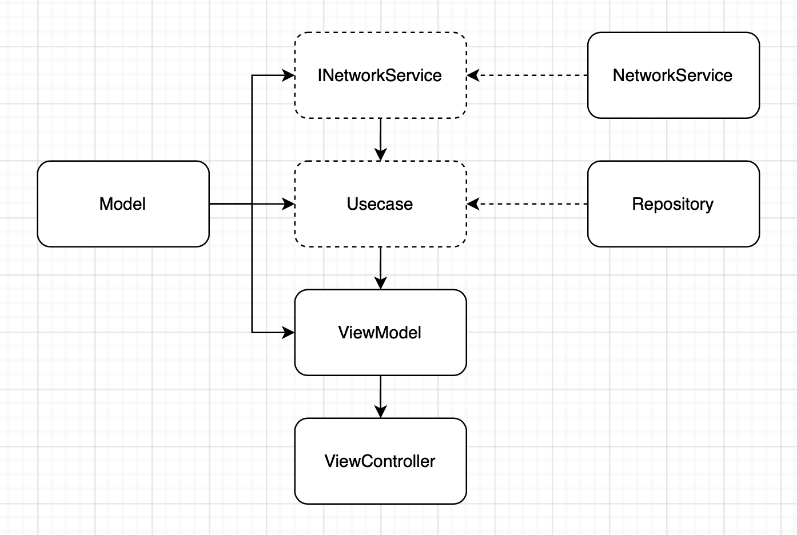
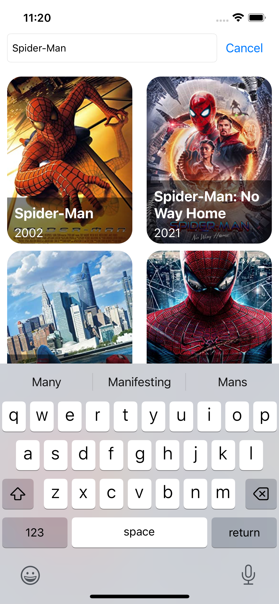

### Movie List Assignment 

## Done Tasks
- Show list of movies when input the title of movie
- Load more data when scroll to bottom of list
- Create some unit test for Repository

## Architecture
- 3 parts: Services, Repository, App

**Services:** Contains Network Services and API Calling Services

**Repositories:** Contains functions to work with API Response get from Services layer

**App:** Use MVVM design pattern to work with the data from Repository and display it on View(View Controller)

### Architecture Diagram

## Screenshots

